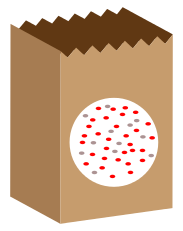

```{r setup, include=FALSE}
knitr::opts_chunk$set(echo = FALSE)
```


```{r echo=FALSE,message=FALSE}
library(limma)
```

# Gene-Ontologies and Annotation

## Gene-Ontology Analysis

In the early days of microarray analysis, people were happy if they got a handful of differentially-expressed genes that they could validate or follow-up. However, with later technologies (and depending on the experimental setup) we might have thousands of statistically-significant results, which no-one has the time to follow-up. Also, we might be interested in pathways / mechanisms that are altered and not just individual genes.

In this section we move towards discovering if our results are ***biologically significant***. Are the genes that we have picked statistical flukes, or are there some commonalities. 

There are two different approaches one might use, and we will cover the theory behind both


    

## Theory Part I: Over-representation analysis

- "Threshold-based": require defintion of a statistical threshold to define list of genes to test (e.g. FDR < 0.01)
- Hypergeometric test or Fisher's Exact test generally used.

The question we are asking here is;

> ***"Are the number of DE genes associated with Theme X significantly greater than what we might expect by chance alone?"***

Where Theme X could be genes belonging to a particular GO (Gene Onotology) term.

Let's imagine that we have a bag full of balls. Each balls represents a gene in the *gene universe*. 
- Paint the balls representing our selected list grey, and paint the rest red.




In this small example, we can define;

- Total number of balls: 40
- Total number of interesting (grey) balls: 10

Now, lets select a number (say, 12) of the balls at random without seeing into the bag and look at what we get


We have picked, at random, 8 grey balls. Using simulations, we can repeat the process and look at how many grey we get. 

The distribution of the data shows what the most-likely values are

```{r}
#see ?rhyper for argument definition
trials <- rhyper(10000,40,10,12)
hist(trials)
```

We can count how many times each value is observed

```{r}
table(trials)
```

Dividing by the number of trials gives a probability of sorts

```{r}
table(trials)/10000

```

The probability of getting *at least* a certain number can also be computed

```{r}
cumsum(table(trials)/10000)
1-cumsum(table(trials)/10000)
```


Back to our example, the distribution of balls can be expressed as a contingency table, on which we can use a Fisher's exact test

Total grey balls: 10
Total in subset: 12

```{r}
df <- data.frame(Selection_in = c(8,4), Selection_out = c(2,26))
rownames(df) <- c("Grey_in", "Grey_out")
df
```


```{r}
df <- data.frame(Selection_in = c("a","c","a+c"), Selection_out = c("b","d","b+d"), RowTotal = c("a +b","c+d","a+b+c+d (=n)"))
rownames(df) <- c("Grey_in", "Grey_out","Column Total")
df
```

The formula for Fishers exact test is;

$$ p = \frac{\binom{a + b}{a}\binom{c +d}{c}}{\binom{n}{a +c}} = \frac{(a+b)!(c+d)!(a+c)!(b+d)!}{a!b!c!d!n!} $$

or less formally;

*P = (ways of choosing grey balls) X (ways of non-grey balls amongst subset) / ways of choosing subset*


**Be careful of how you define the universe**

What genes were candidates for selection as universe?

- All possible genes
- All genes represented on the chip
- All genes that have a GO annotation
- All genes from the chip that pass a **non-specific** filter

Just changing the size of the universe alone can have a massive effect on the p-value

- In the formula, we have to divide by the universe size
    + so the probability will become very small as this increases
    + even if all the other numbers stay the same


## Worked Example: Drosophila genes regulated by pasilla

In order to get a larger set of differentially-expressed genes across the whole genome, we will use a different dataset where gene counts have already been computed 

## Preamble

> In the study of Brooks et al. 2011, the Pasilla (PS) gene, Drosophila homologue of the Human splicing regulators Nova-1 and Nova-2 Proteins, was depleted in Drosophila melanogaster by RNAi. The authors wanted to identify exons that are regulated by Pasilla gene using RNA sequencing data.
Total RNA was isolated and used for preparing either single-end or paired-end RNA-seq libraries for treated (PS depleted) samples and untreated samples. These libraries were sequenced to obtain a collection of RNA sequencing reads for each sample. The effects of Pasilla gene depletion on splicing events can then be analyzed by comparison of RNA sequencing data of the treated (PS depleted) and the untreated samples.
The genome of Drosophila melanogaster is known and assembled. It can be used as reference genome to ease this analysis. In a reference based RNA-seq data analysis, the reads are aligned (or mapped) against a reference genome, Drosophila melanogaster here, to significantly improve the ability to reconstruct transcripts and then identify differences of expression between several conditions.

## Data

To save time and memory, pre-counted files are available online ([https://zenodo.org/record/1185122#.WqGfbnW0PCI](https://zenodo.org/record/1185122#.WqGfbnW0PCI))

- GSM461176_untreat_single.counts
- GSM461177_untreat_paired.counts
- GSM461178_untreat_paired.counts
- GSM461179_treat_single.counts
- GSM461180_treat_paired.counts
- GSM461181_treat_paired.counts
- GSM461182_untreat_single.counts

## Exercise

- Download the files from the zenodo link, and upload them to Galaxy
- Use DESeq2 as with the previous section
- Filter the results using the condition `c7 < 0.05 and (c3 > 1.0 or c3 < -1.0)`

(Optional) Sort by a column:

We can sort the table by values in a particular column (eg. log fold change)

1. Filter and Sort -> Sort
2. Select the most recent filtered table as the dataset
3. Sort log fold change by Descending order

## Preparing the data for GOrilla

We will be using the online tool [GOrilla](http://cbl-gorilla.cs.technion.ac.il/)

1. Select the table that you have filtered and sorted
2. Operation: Keep
3. Select only column 1 (Gene IDs) from List of Fields
4. Save the outputted dataset as “DE_Genes.txt”


##Make a background list of genes:

This is the list of all the genes you tested in your RNAseq pipeline. 

1. Filter and Sort -> Filter
2. Select the DESeq2 results from the previous step *prior to p-value and fold-change filtering*
3. Text Manipulation -> Cut
4. Keep the first column
5. Download and save the resulting file of gene names as
“Background.txt”

## Using GOrilla
1. Go to http://cbl-gorilla.cs.technion.ac.il/
2. Read the “Running Example”


3. Choose Organism: `Drosophila melanogaster`
4. Choose running mode: `Two unranked lists of genes`
5. Upload `DE_Genes.txt` as the Target set.
6. Upload `Background.txt` as the Background set.
7. Choose an Ontology: `Process`
8. `Search Enriched GO terms`

## Theory Part II: Threshold-free

For these tests, we don't have to specify a statistical threshold and use the test statistics (log fold-change) from *all* genes as the input to the test. The popular *Gene Set Enrichment Analysis (GSEA)* uses this approach. These tests can be used to detect differential expression for a group of genes, even when the effects are too small or there is too little data to detect the genes individually.


*Subramanian et al, PNAS 2005*

The Broad institute provides [a version of GSEA](http://software.broadinstitute.org/gsea/index.jsp) that can be run via a java application. Another option is [***GeneTrail***](http://genetrail.bioinf.uni-sb.de/enrichment_analysis.php?js=1&cc=1) which has the option to do a GSEA-style analysis.

## Preparing data for GeneTrail

1. **Text Maniupulation -> Filter** with condition `c3 != 'NA'`
   + select `DESeq2 result file...` as input
2. **Text Manipulation -> Cut** 
   + selecting columns `c1 c3` as the columns to cut
3. Download the filtered, cut, table as a file (e.g. `gsea-input.txt`)

## Running GeneTrail

Go to the [GeneTrail website](https://genetrail2.bioinf.uni-sb.de/)

1. Under Transcriptome, select **Start Analysis**
2. Under **Upload Data** select the data source to be *a text file* and browse to where you downloaded the file `gsea-input.txt`
3. Keep the default categories and **Start Analysis**
4. Explore the results to see what pathways are reported

